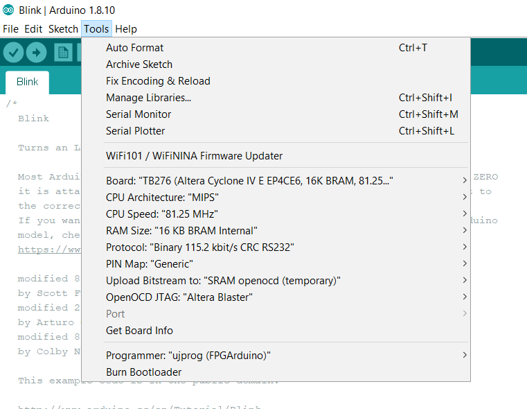

# FPGArduino
This is a simplified version of the f32c 32-bit MIPS CPU written in VHDP. It supports FPGArduino for easy programming and is mainly meant for educational purposes.

## Hardware
Copy the Repository, compile with the VHDPlus IDE and program the FPGA.

## Software
Check out [this](http://www.nxlab.fer.hr/fpgarduino/) for more information.

1) Download and install the [Arduino IDE](https://www.arduino.cc/en/Main/Software) for your operating system. Versions 1.6.4 or later. If you already have a recent version there's no need to reinstall the IDE.

2) Start Arduino IDE. Select pull down menu File->Preferences
Enter automatic installation URL in the field:
Additional Boards Manager URLs
http://www.nxlab.fer.hr/fpgarduino/package_f32c_core_index.json

3) Select pull down menu Tools->Board->Boards Manager
scroll down, find FPGArduino, click it and click "Install"

4) Optionally you may need to install libusb using [Zadig](https://zadig.akeo.ie/)

This are the needed settings:

On-board peripherals and external physical connectors may be mapped to Arduino logical pin numbers in a board-specific way. In general, pushbuttons and rotary knobs are mapped to logical pins 0 to 7, LEDs from 8 to 15, slide switches from 16 to 23, and character LCD (if present) to pins 24 to 31. Pin numbers from 32 upwards are typically routed as GPIO to external connectors, such as PMODs on Xilinx / Digilent boards.
